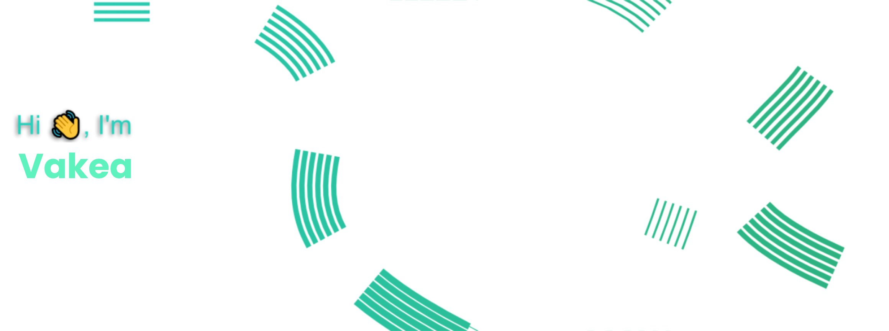

    
    
    
    
    

  
Hey! welcome to my profile my name is Vakea, and I'm an 21-year-old self-taught developer who constantly starts new side projects that never get finished, I want to build meaningful and fun projects to make people's lives a little bit better, I'm currently doing web app development and getting into the open source community, You can learn more about the tools I use and my latest projects here! 🐱‍💻

#

#### Tools I use:

\

    I use a lots of other languages but it would be too long to list everything here :3

---

    

    &copy; 2022 GHIDORAH.
    

